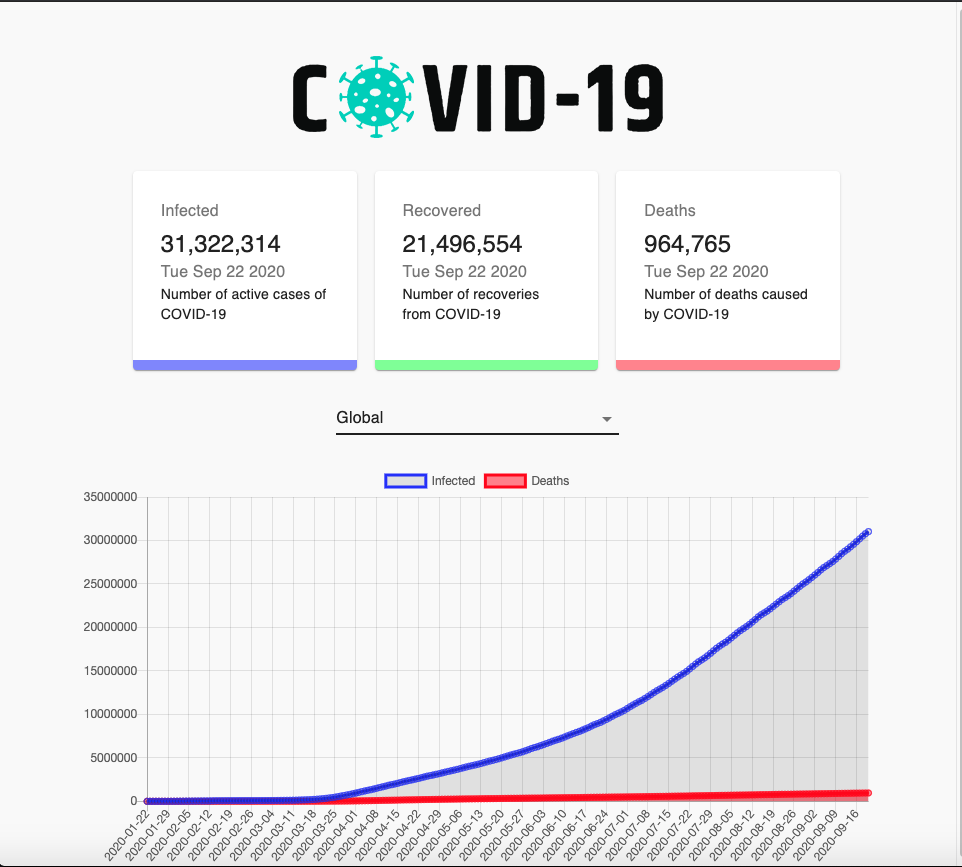
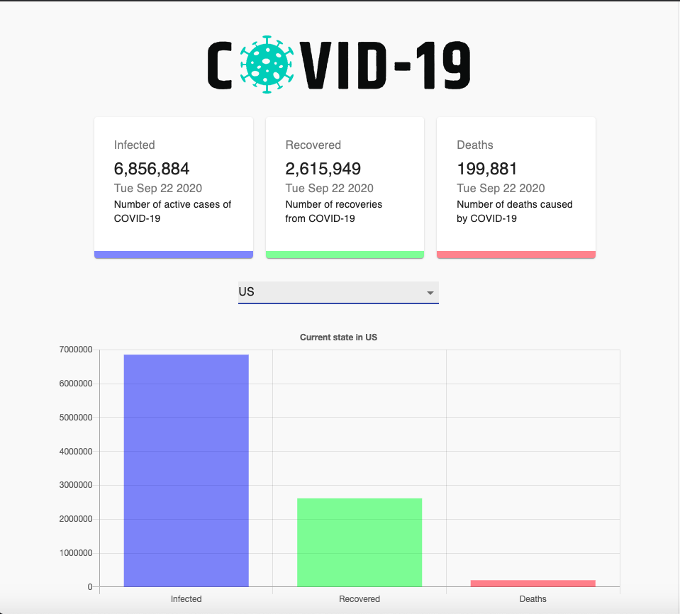

This project was bootstrapped with [Create React App](https://github.com/facebook/create-react-app).
## CovidTracker
CovidTracker is a web application using ReactJS, making use of the Material UI Framework. This project is an adaption from online youtube tutorial series, with my own architectural tweaks made within the project.  

### Landing Page

### United States Statistics

### How To Run Locally

In the project directory, you can run:

### `npm start`

Runs the app in the development mode. 
Open [http://localhost:3000](http://localhost:3000) to view it in the browser.

The page will reload if you make edits. 
You will also see any lint errors in the console.

Video Tutorial Link: https://www.youtube.com/watch?v=khJlrj3Y6Ls
